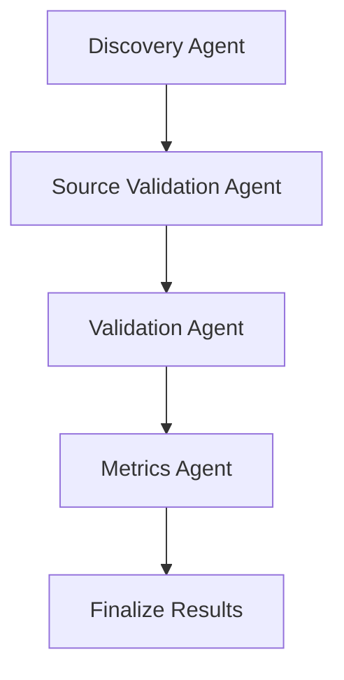
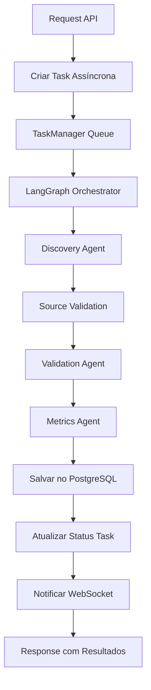

# NVIDIA Inception AI - Startup Discovery System

## Sumário

- [1. Introdução](#1-introdução)
- [2. Tecnologias](#2-tecnologias)
- [3. Arquitetura](#3-arquitetura)
- [4. Orquestração com LangGraph](#4-orquestração-com-langgraph)
- [5. Configuração e Instalação](#5-configuração-e-instalação)
- [6. Documentação da API](#6-documentação-da-api)
- [7. Sistema de Filas Assíncronas](#7-sistema-de-filas-assíncronas)
- [8. Critérios de Métricas](#8-critérios-de-métricas)
- [9. Fluxo de Operação](#9-fluxo-de-operação)
- [10. Próximos Passos](#10-próximos-passos)

## 1. Introdução

A plataforma foi desenvolvida para automatizar o processo de descoberta, validação e análise de startups de IA que possuem investimento de Venture Capital. O sistema foi criado especificamente para apoiar o programa NVIDIA Inception na identificação de startups promissoras através de um pipeline robusto de agentes inteligentes.

## 2. Tecnologias

- **Backend**: FastAPI (Python 3.12)
- **Orquestração**: LangGraph StateGraph
- **Modelo AI**: OpenAI GPT-4o-mini
- **Database**: PostgreSQL com SQLAlchemy
- **Frontend**: React + Vite + Tailwind CSS
- **Container**: Docker & Docker Compose
- **Processamento**: Queue assíncrona com threading

## 3. Arquitetura

### Separação Frontend/Backend

O projeto foi estruturado com **arquitetura desacoplada** para maximizar flexibilidade e modularidade:

#### Backend (FastAPI)
- **API RESTful Completa**: Todos os recursos disponíveis via endpoints HTTP
- **Independência de Interface**: Funciona sem necessidade de frontend
- **Integração Flexível**: Pode ser consumido por qualquer cliente (web, mobile, CLI)
- **Documentação Automática**: Swagger integrado

#### Frontend (React)
- **Interface Opcional**: O sistema funciona completamente via API
- **Dashboard Interativo**: Visualização rica dos dados e métricas
- **Experiência do Usuário**: Interface amigável para operações complexas

### Benefícios da Arquitetura Modular

1. **Uso via API Pura**: Organizações podem integrar diretamente com suas ferramentas
2. **Escalabilidade Independente**: Frontend e backend podem escalar separadamente  
3. **Flexibilidade de Deploy**: Deploy apenas do backend para uso programático
4. **Manutenção Simplificada**: Atualizações independentes de cada camada
5. **Integração Empresarial**: Fácil integração com sistemas existentes via REST API

## 4. Orquestração com LangGraph

### O que é LangGraph?

**LangGraph** é um framework da LangChain para construir aplicações de IA com múltiplos agentes usando grafos direcionados. Ele permite:

- **Fluxos Complexos**: Orquestração de múltiplos LLMs em pipelines estruturados
- **Estado Compartilhado**: Dados persistem entre diferentes etapas do processamento
- **Controle de Fluxo**: Decisões condicionais e paralelização inteligente
- **Observabilidade**: Tracking completo de execução e debugging avançado

### Por que LangGraph neste Projeto?

#### 1. **Pipeline Sequencial Complexo**
O sistema requer 5 agentes especializados que devem executar em ordem específica, cada um consumindo resultados do anterior.

#### 2. **Recuperação de Falhas**
LangGraph permite retomada de execução a partir de qualquer ponto de falha, fundamental para processamentos longos.

#### 3. **Pipeline de Agentes Especializados**



- **Discovery Agent**: Busca startups usando WebSearch + GPT-4o-mini
- **Source Validation**: Valida fontes e funding de VC
- **Validation Agent**: Testa websites e confirma existência real
- **Metrics Agent**: Calcula scores de parceria baseados em critérios NVIDIA
- **Finalize Results**: Ajustar na estrtura JSON para cadastrar na plataforma

#### 5. **Escalabilidade e Performance**
- Processamento assíncrono integrado
- Controle de recursos (tokens, rate limits)
- Paralelização inteligente quando possível

## 5. Configuração e Instalação

### Requisitos
- Docker e Docker Compose
- Chave de API da OpenAI
- Python 3.12+ (para desenvolvimento local)

### Passos de Instalação

1. **Clone o repositório**
```bash
git clone https://github.com/mateusbepplerpereira/nvidia-inception-ai.git
cd nvidia-inception-ai
```

2. **Configure o ambiente**
```bash
cd backend
cp .env.example .env
# Edite o .env com sua chave OpenAI
```

3. **Inicie os serviços**
```bash
# Opção 1: Script automatizado
./dev.sh

# Opção 2: Docker Compose direto
docker-compose up -d
```

4. **Acesse os serviços**
- **API**: http://localhost:8000/docs (Documentação Swagger)
- **Health Check**: http://localhost:8000/health
- **Frontend**: http://localhost:3000 (se habilitado)
- **Adminer** (Debug DB): http://localhost:8080

## 6. Documentação da API

### Swagger

Toda a documentação da API está **automaticamente disponível** através do Swagger integrado:

**Acesse: http://localhost:8000/docs**


## 7. Sistema de Filas Assíncronas

### TaskManager Singleton
- **Fila Unificada**: Gerencia todas as tasks de processamento em uma única fila thread-safe
- **Worker Thread**: Thread dedicado que processa tasks em background sem bloquear a API
- **Recuperação de Falhas**: Tasks com falha são reprocessadas automaticamente
- **Monitoramento**: Status em tempo real da fila via endpoints dedicados

### Características Técnicas
- **Thread-Safe**: Implementação com `threading.Queue` para concorrência segura  
- **Singleton Pattern**: Única instância global compartilhada pela aplicação
- **Status Tracking**: Acompanha progresso via database com timestamps detalhados
- **Graceful Shutdown**: Finalização elegante sem perda de dados

### Benefícios
- **API Responsiva**: Requests não bloqueiam durante processamento longo
- **Escalabilidade**: Capacidade de processar múltiplas descobertas simultaneamente
- **Observabilidade**: Logs completos de execução e métricas de performance

## 8. Critérios de Métricas

O sistema utiliza um algoritmo de métricas baseado em média simples para avaliar o potencial de parceria de cada startup:

### Pontuação de Demanda de Mercado
- **Setor em Alta Demanda**: Análise de tendências de mercado e investimento
- **Tecnologias Relevantes**: Avaliação do conjunto tecnológico e inovação
- **Oportunidade de Mercado**: Potencial de crescimento e expansão
- **Momento de Mercado**: Adequação do momento para entrada no setor

### Pontuação de Nível Técnico
- **Qualificação do CTO**: Formação técnica e experiência da liderança
- **Conjunto Tecnológico**: Modernidade e adequação das tecnologias utilizadas
- **Inovação Técnica**: Grau de diferenciação e propriedade intelectual
- **Capacidade de Execução**: Histórico de entrega e qualidade técnica

### Pontuação de Potencial de Parceria
- **Investimento Recebido**: Valor e qualidade dos rounds de financiamento
- **Qualidade dos Investidores**: Reputação e rede dos fundos de investimento
- **Compatibilidade com NVIDIA**: Alinhamento com tecnologias e objetivos NVIDIA
- **Potencial de Sinergia**: Oportunidades de colaboração e integração

### Fórmula de Cálculo
```
Pontuação Total = (Demanda de Mercado + Nível Técnico + Potencial de Parceria) ÷ 3
```

As pontuações variam de 0-100, onde:
- **90-100**: Parceria altamente recomendada
- **70-89**: Forte potencial de parceria  
- **50-69**: Potencial moderado, requer análise adicional
- **< 50**: Baixo potencial no momento atual

## 9. Fluxo de Operação

### Processo Completo de Descoberta



### Detalhamento por Etapa

1. **Request Inicial** → Cliente envia `POST /api/agents/task/run` com parâmetros
2. **Task Creation** → Sistema cria record na tabela `task_logs` com status "pending"  
3. **Queue Management** → TaskManager adiciona task na fila assíncrona
4. **LangGraph Execution** → Orquestrador executa pipeline sequencial:
   - **Discovery**: Busca startups via WebSearch + GPT-4o-mini
   - **Source Validation**: Valida fontes de funding e informações
   - **Validation**: Testa websites e confirma existência real
   - **Metrics**: Calcula scores baseados nos critérios NVIDIA
5. **Data Persistence** → Resultados salvos nas tabelas correspondentes
6. **Status Updates** → Task marcada como "completed" ou "failed"
7. **Real-time Notifications** → WebSocket notifica frontend sobre conclusão
8. **Response Tracking** → Cliente consulta status via `GET /api/agents/tasks/{id}`

## 10. Próximos Passos

### Sistema de Recomendações Inteligente
Implementar modelo de machine learning para prever potencial de parceria baseado em histórico de decisões e características das startups.

### Análise de Sentimento e Market Intelligence
Monitoramento automatizado de notícias, redes sociais e relatórios de mercado sobre startups descobertas para avaliar reputação, momentum e percepção do mercado. Identificação de tendências emergentes em IA e setores tecnológicos para orientar estratégias de busca e priorização de análises.

### Integração com Fontes de Dados Estratégicas
Conectar com bases de dados de investimento (Crunchbase Pro, PitchBook, CB Insights) para enriquecimento automático de informações financeiras e validação cruzada de dados.
